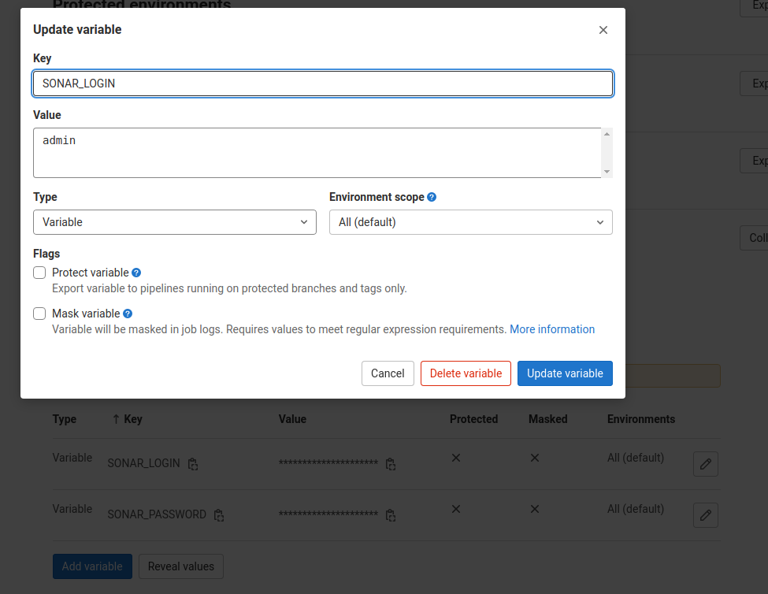
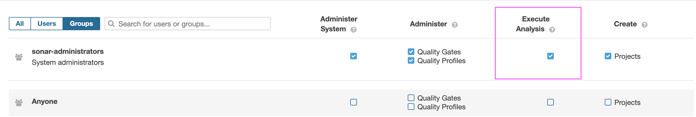

# Project description
Sonarqube for security review.

# Instructions to setup ICM Sonarqube with Gitlab
- Install Sonarqube instance with the docker-compose.yml and .env files. (see start.sh to init)
```bash
cd ~
git clone https://gitlab.com/icm-institute/dsi/dev/docker-compose/sonarqube-docker-compose
./start.sh init
```
- In gitlab, add the sonarqube stage in .gitlab-ci.tpl.yml
- In gitlab, add SONAR_LOGIN and SONAR_PASSWORD as UNPROTECTED variables.
- Test with a local gitlab runner
```bash
~/Documents/sonar-scanner-4.7.0.2747-linux/bin/sonar-scanner -Dsonar.qualitygate.wait=true -Dsonar.sources="./react" -Dsonar.host.url="https://sonarqube.icm-institute.org" -Dsonar.login=admin -Dsonar.password= -Dsonar.projectKey=xnat -Dsonar.projectName="Xnat"
```

# Gitlab steps



# Change admin password
```bash
PASSWORD_SONAR=ki87465vez984hytr3
curl -u admin:admin "http://localhost:80/api/users/change_password" --data "login=admin&password=${PASSWORD_SONAR}&previousPassword=admin"
```

# Upgrade sonarqube
- Find the new version to use at https://docs.sonarqube.org/latest/instance-administration/plugin-version-matrix/  
- run ./start.sh upgrade
- Go to https://sonarqube.icm-institute.org/setup and follow the setup instructions.

# Documentation
The Sonarqube API documentation is available on the sonarqube web site, with all parameters at this url : http://localhost:80/web_api/api/plugins

# (old) Copy a dump from old to new architecture
```bash
ssh ICONICS_SONARQUBE_Staging_Technic sudo cp /var/data/postgresql_data/dumps/2021-10-21-at-15-20-36_sonarqube_daily_dump.out.gz /home/ec2-user/2021-10-21-at-15-20-36_sonarqube_daily_dump.out.gz
ssh ICONICS_SONARQUBE_Staging_Technic sudo chmod 777 /home/ec2-user/2021-10-21-at-15-20-36_sonarqube_daily_dump.out.gz
scp ec2-user@ICONICS_SONARQUBE_Staging_Technic:/home/ec2-user/2021-10-21-at-15-20-36_sonarqube_daily_dump.out.gz /home/devops/2021-10-21-at-15-20-36_sonarqube_daily_dump.out.gz
ssh ICONICS_SONARQUBE_Staging_Technic rm /home/ec2-user/2021-10-21-at-15-20-36_sonarqube_daily_dump.out.gz
scp /home/devops/2021-10-21-at-15-20-36_sonarqube_daily_dump.out.gz ec2-user@Sonarqube_New:/home/ec2-user/2021-10-21-at-15-20-36_sonarqube_daily_dump.out.gz
ssh Sonarqube_New gunzip /home/ec2-user/2021-10-21-at-15-20-36_sonarqube_daily_dump.out.gz
ssh Sonarqube_New rm /home/ec2-user/2021-10-21-at-15-20-36_sonarqube_daily_dump.out.gz
# After docker-compose is up
ssh Sonarqube_New sudo cp /home/ec2-user/2021-10-21-at-15-20-36_sonarqube_daily_dump.out /var/data/postgresql_data/2021-10-21-at-15-20-36_sonarqube_daily_dump.out
# Database must exist before dump import
ssh Sonarqube_New
cd /home/ec2-user/sonarqube-docker-compose
docker-compose exec sonarqube-db bash -c "psql -U sonar -c 'SELECT pid, pg_terminate_backend(pid) FROM pg_stat_activity WHERE pid <> pg_backend_pid();'" # End all connections
docker-compose exec sonarqube-db bash -c "dropdb -U sonar sonar && createdb -U sonar sonar"
docker-compose exec sonarqube-db bash -c "psql -U sonar -s < /var/lib/postgresql/data/2021-10-21-at-15-20-36_sonarqube_daily_dump.out"
docker-compose down
docker-compose up -d && docker-compose logs -ft
```
